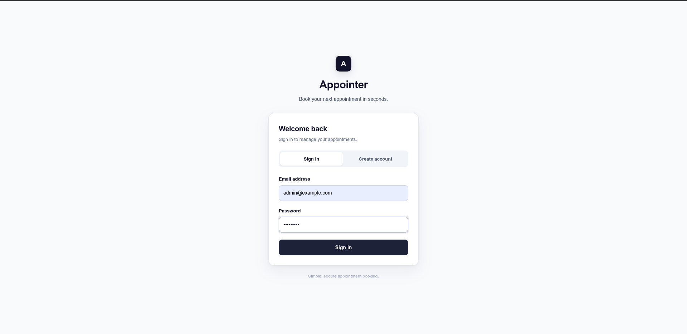
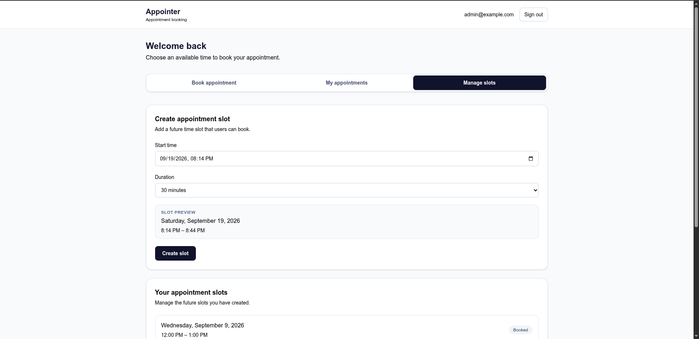
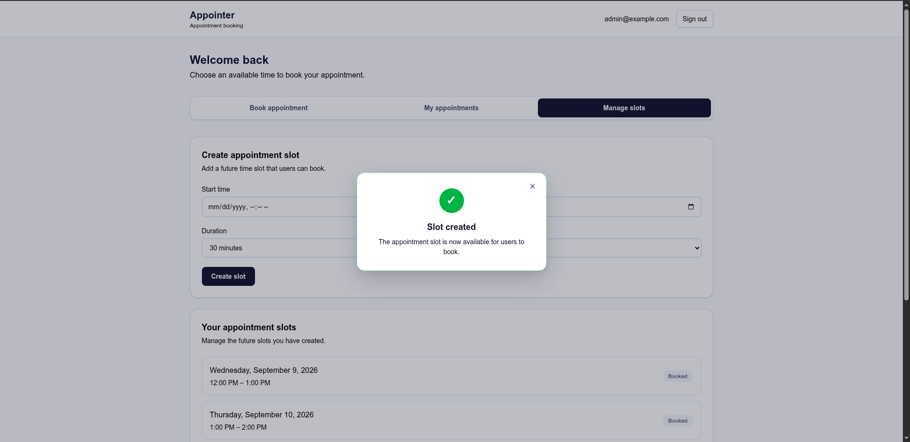
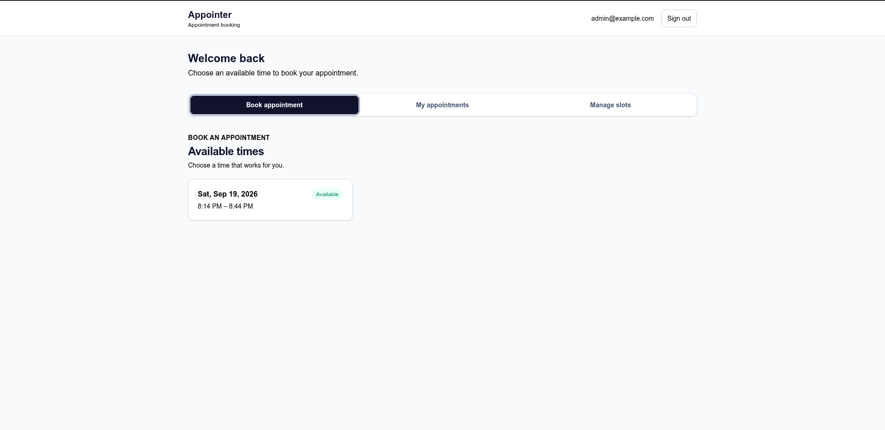
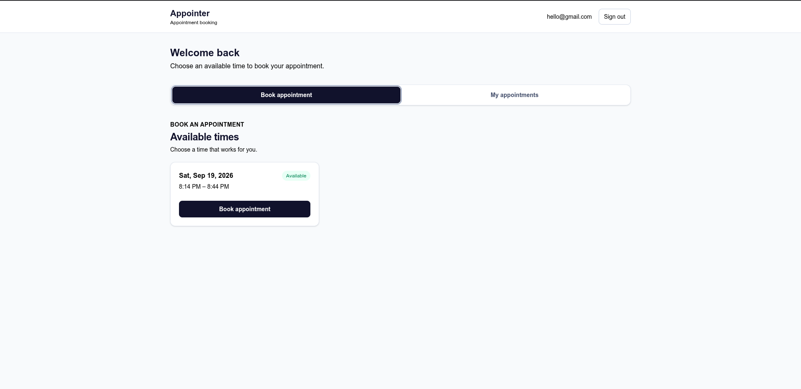
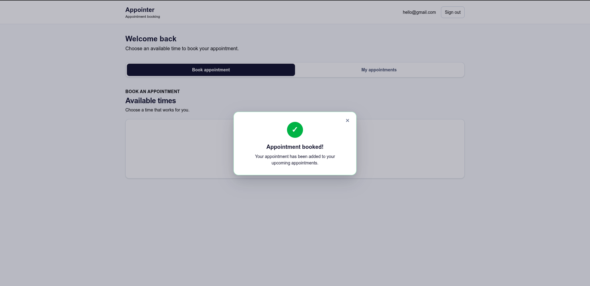
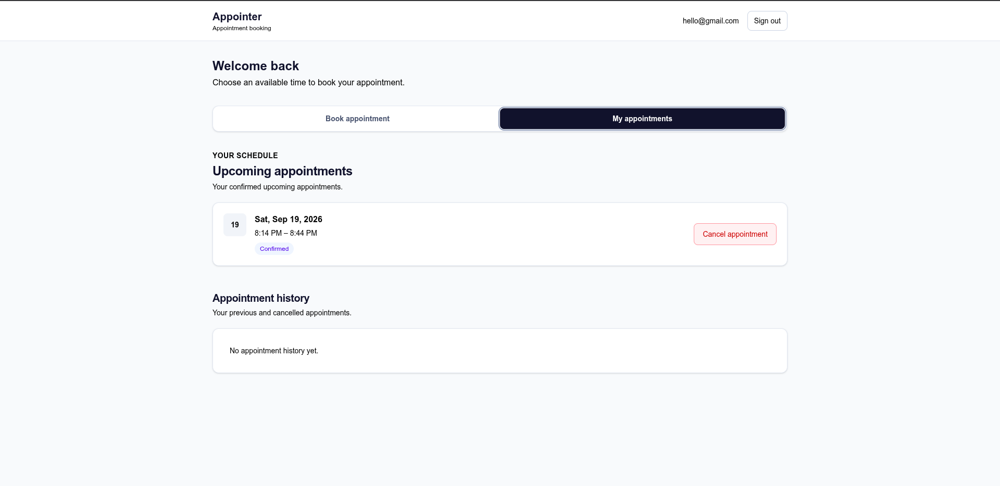
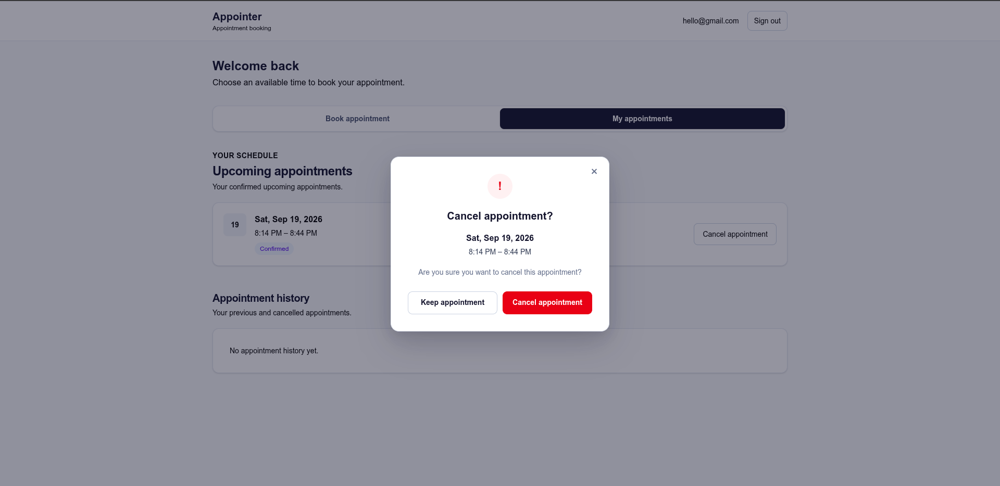
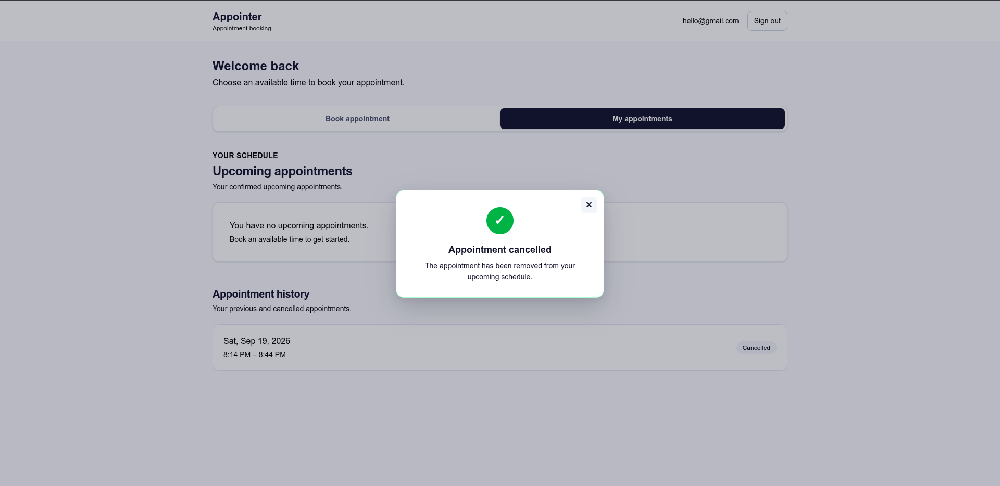
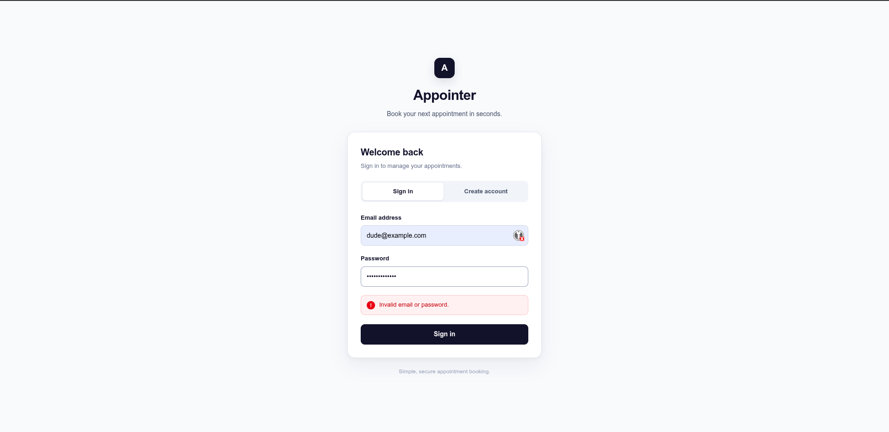

# Appointly

## 1. Overview

A full-stack appointment booking application built with Next.js, React, TypeScript, Drizzle ORM, and PostgreSQL.

Appointly allows users to book and cancel appointments, while admins create and manage available appointment slots.

Link: https://appointly-ochre.vercel.app/

## 2. Features


## Features

- Session-based authentication
- Role-based access control
- Admin slot creation and management
- 15, 30, 45, and 60 minute slots
- Slot overlap prevention
- Appointment booking and cancellation
- Concurrent booking protection
- Appointment history
- Responsive and accessible UI
- Loading, error, and success feedback

## 3. Screenshots

## Screenshots

### Admin Login



### Admin Slot Management



### Admin Slot Creation



### Admin Booking View



### User Booking



### Appointment Booked



### Upcoming and Past Appointments



### Appointment Cancellation



### Appointment Cancelled



### Login Error



## 4. Tech Stack

## Tech Stack

| Layer | Technology |
|---|---|
| Frontend | Next.js, React, TypeScript |
| Styling | Tailwind CSS |
| Backend | Next.js Route Handlers |
| Validation | Zod |
| ORM | Drizzle ORM |
| Database | PostgreSQL / Neon |
| Testing | Vitest |
| Deployment | Vercel |

## 5. Architecture

## Architecture

Appointly uses a simple full-stack architecture:

Browser
   ↓
Next.js
   ├── React UI
   └── API Route Handlers
          ↓
      Drizzle ORM
          ↓
    PostgreSQL / Neon

Authentication, authorization, validation, and business rules are enforced on the server.

See [Architecture Documentation](./docs/architecture.md) for detailed diagrams and implementation details.

## 6. Database

## Database

Appointly uses PostgreSQL hosted on Neon with Drizzle ORM.

Core entities:

- `users`
- `sessions`
- `appointment_slots`
- `appointments`

The database enforces foreign keys, valid slot time ranges, unique user emails, and one active booking per slot.

See [ERD Documentation](./docs/erd.md).

## 7. Authentication & Authorization

## Authentication & Authorization

Authentication uses server-side sessions stored in PostgreSQL.

Two roles are supported:

- **USER** — book, view, and cancel their own appointments.
- **ADMIN** — create and manage their own appointment slots.

Authorization and ownership checks are enforced server-side. Frontend restrictions are treated only as UX.

## 8. Booking Concurrency

## Booking Concurrency

Concurrent booking is protected at the database level with a partial unique index:
```text
UNIQUE(slot_id) WHERE status = 'BOOKED'
```
If two users attempt to book the same slot concurrently:

* One request succeeds with `201`.
* The other receives `409 SLOT_ALREADY_BOOKED`.

This prevents race conditions that cannot be reliably handled by frontend availability checks alone.


## 9. UX & Design

## UX & Design

The interface focuses on clear feedback and minimal interaction cost.

- Panel-based navigation for booking, appointments, and admin management
- Loading and disabled states for asynchronous actions
- Centered success/error notifications
- Confirmation dialogs for destructive actions
- Responsive mobile layout
- Keyboard focus and reduced-motion support

## 10. Engineering Trade-offs

## Engineering Trade-offs

### Database constraint over frontend-only checks
Frontend availability checks improve UX, but PostgreSQL remains the source of truth for concurrent bookings.

### Polling over WebSockets
The dashboard refreshes after mutations, on visibility changes, and every 20 seconds. This provides adequate freshness without adding realtime infrastructure.

### Server-side sessions
Sessions keep authentication state server-controlled and make authorization decisions independent of client state.

### Cancellation as a state change
Appointments move from `BOOKED` to `CANCELLED` instead of being deleted, preserving history while freeing the slot.

### Simple architecture over over-engineering
The project intentionally avoids unnecessary services such as Redis, WebSockets, queues, and microservices given the application's scope.

## 11. Getting Started

## Getting Started

Clone the repository and install dependencies:

```bash
git clone https://github.com/Firespiko/appointment-booking
cd appointment-booking
pnpm install
````


## 12. Environment Variables

## Environment Variables

Create a `.env` file in the project root:

```env
DATABASE_URL="your-neon-database-url"
````

Do not commit `.env` or any production secrets.

A template is provided in `.env.example`.


## 13. Database Setup

## Database Setup

Apply the Drizzle migrations:

```bash
pnpm drizzle-kit migrate
````

Seed the database:

```bash
pnpm tsx scripts/seed.ts
```


## 14. Running Locally

## Running Locally

Start the development server:

```bash
pnpm dev
````

The application will be available at:

```text
http://localhost:3000
```

For a production build:

```bash
pnpm build
pnpm start
```


## 15. Testing

## Testing

Run the test suite:

```bash
pnpm test
````

Run the TypeScript check:

```bash
pnpm exec tsc --noEmit
```

Run ESLint:

```bash
pnpm lint
```

Build the application:

```bash
pnpm build
```

The test suite includes unit tests for appointment rules and an integration test for concurrent booking protection.

## 16. Deployment

## Deployment

The application is deployed on Vercel with Neon PostgreSQL as the production database.

```text
Browser → Vercel → Next.js → Neon PostgreSQL
````

Set `DATABASE_URL` in the Vercel project environment variables before deployment.

### Production build

```bash
pnpm build
```


## 17. API Documentation

## API Documentation

Detailed API routes, request formats, responses, authentication requirements, and error codes are documented in:

[API Documentation](./docs/api.md)

## 18. Project Structure

## Project Structure

```text
app/        # Next.js pages and API routes
src/        # Features, database, authentication, and shared utilities
tests/      # Unit and integration tests
docs/       # Architecture, API, and ERD documentation
public/     # Static diagrams and assets
````


## 20. License

## License

This project was created as a software engineering assignment.
