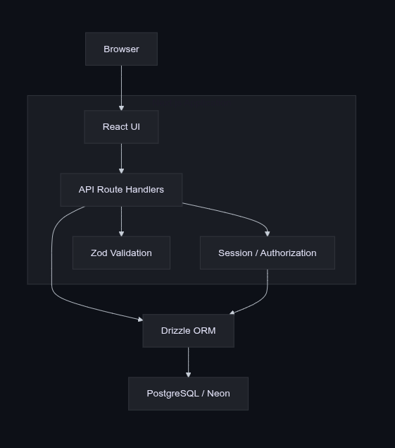
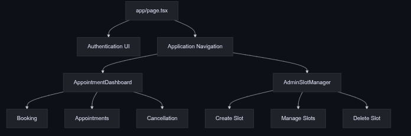
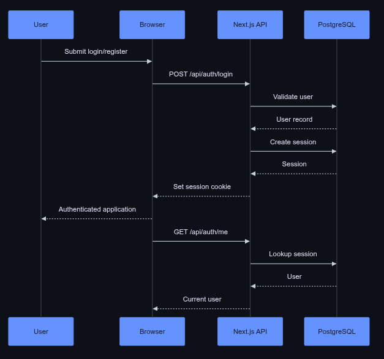
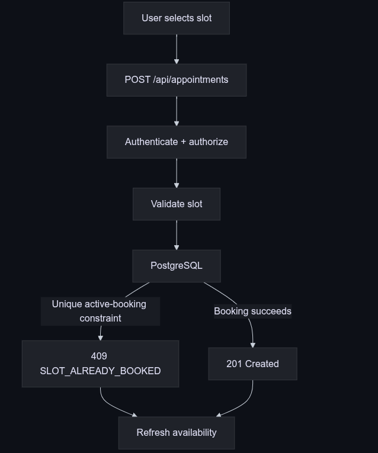
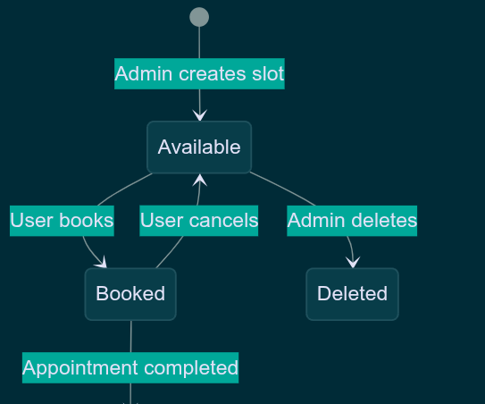

# Appointly Architecture

## Overview

Appointly is a full-stack appointment booking application built with Next.js, React, TypeScript, Drizzle ORM, and PostgreSQL.

The architecture focuses on four concerns:

- Authentication and authorization
- Appointment booking
- Slot management
- Database consistency

## System Architecture



The browser communicates with Next.js API route handlers. API routes handle authentication, authorization, validation, and business operations before accessing PostgreSQL through Drizzle ORM.

## Frontend Architecture



The application uses a single-page application shell with role-aware panels:

- **Book appointment**
- **My appointments**
- **Manage slots** — admin only

Appointment behavior is isolated in `AppointmentDashboard`, while administrative slot management is handled by `AdminSlotManager`.

## Authentication



Authentication uses server-side sessions stored in PostgreSQL.

The session cookie identifies the authenticated user. Protected API routes resolve the current user before performing operations.

Authorization is enforced server-side.

### Roles

**USER**

- View available slots
- Book appointments
- View own appointments
- Cancel own appointments

**ADMIN**

- Create appointment slots
- Manage own slots
- Delete eligible slots

Admins cannot book appointments.

## Booking



Booking is protected by a database-level constraint allowing only one active `BOOKED` appointment per slot.

If two users attempt to book the same slot concurrently:

- One request succeeds with `201 Created`
- The other receives `409 SLOT_ALREADY_BOOKED`

This prevents race conditions from being handled solely by the frontend.

## Slot Management



Admins can create future slots using supported durations of 15, 30, 45, or 60 minutes.

The backend rejects:

- Past slots
- Invalid time ranges
- Overlapping slots

Admins can delete only their own unbooked slots.

## Cancellation

Appointments are cancelled by changing their status from:

```text
BOOKED → CANCELLED
````

The appointment record is retained so that historical appointments remain available to the user.

A cancelled appointment no longer counts as an active booking for its slot.

## Validation

Request payloads are validated with Zod schemas before database operations.

Client-side validation provides immediate feedback, but server-side validation remains authoritative.

## Data Refresh

The appointment dashboard refreshes data:

* After booking
* After cancellation
* When the page becomes visible
* Every 20 seconds

This keeps availability reasonably fresh without introducing WebSocket infrastructure.

## Project Structure

```text
app/
├── api/
├── globals.css
├── layout.tsx
└── page.tsx

src/
├── components/
├── db/
├── features/
│   ├── appointments/
│   ├── auth/
│   └── slots/
└── lib/

tests/
├── integration/
└── unit/
```

## Database

The core entities are:

```text
users
sessions
appointment_slots
appointments
```

Drizzle ORM provides typed database access, while PostgreSQL enforces important integrity constraints.

## Testing

Vitest is used for unit and integration testing.

Current automated coverage includes:

* Appointment time rules
* Concurrent booking protection

## Deployment

```text
Browser
   ↓
Vercel
   ↓
Next.js
   ↓
Neon PostgreSQL
```

Production configuration uses environment variables, including:

```text
DATABASE_URL
```

Secrets are not committed to the repository.

## Design Principles

* Keep the application small and focused.
* Enforce authorization on the server.
* Use database constraints for critical consistency rules.
* Preserve appointment history.
* Keep feature logic separated by domain.
* Avoid unnecessary infrastructure.

