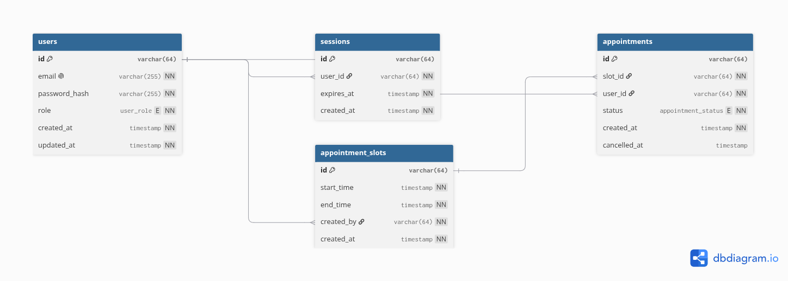

# Appointly ERD

## Overview

Appointly uses four core entities:

- `users`
- `sessions`
- `appointment_slots`
- `appointments`



## Relationships

- A user can have multiple sessions.
- An admin can create multiple appointment slots.
- A user can have multiple appointments.
- An appointment belongs to one appointment slot.
- A slot can have multiple historical appointments, but only one active `BOOKED` appointment.

## Users

Stores account and authorization information.

Key fields:

```text
id
email
password_hash
role
created_at
updated_at
````

`email` is unique.

Roles:

```text
USER
ADMIN
```

## Sessions

Stores authenticated sessions associated with users.

Key fields:

```text
id
user_id
expires_at
created_at
```

Deleting a user also removes their sessions.

## Appointment Slots

Represents bookable time windows created by admins.

Key fields:

```text
id
start_time
end_time
created_by
created_at
```

The database requires:

```text
start_time < end_time
```

## Appointments

Represents a user's booking for a slot.

Key fields:

```text
id
slot_id
user_id
status
created_at
cancelled_at
```

Status values:

```text
BOOKED
CANCELLED
```

Appointments are cancelled by changing their status rather than deleting the record.

## Booking Integrity

A partial unique index ensures that each slot can have only one active booking:

```text
UNIQUE(slot_id)
WHERE status = 'BOOKED'
```

This protects the booking operation against concurrent requests.

Historical `CANCELLED` appointments remain associated with the slot without preventing a new booking.

## Referential Integrity

```text
sessions.user_id
    → users.id

appointment_slots.created_by
    → users.id

appointments.slot_id
    → appointment_slots.id

appointments.user_id
    → users.id
```

Foreign-key constraints preserve the integrity of relationships between entities.

